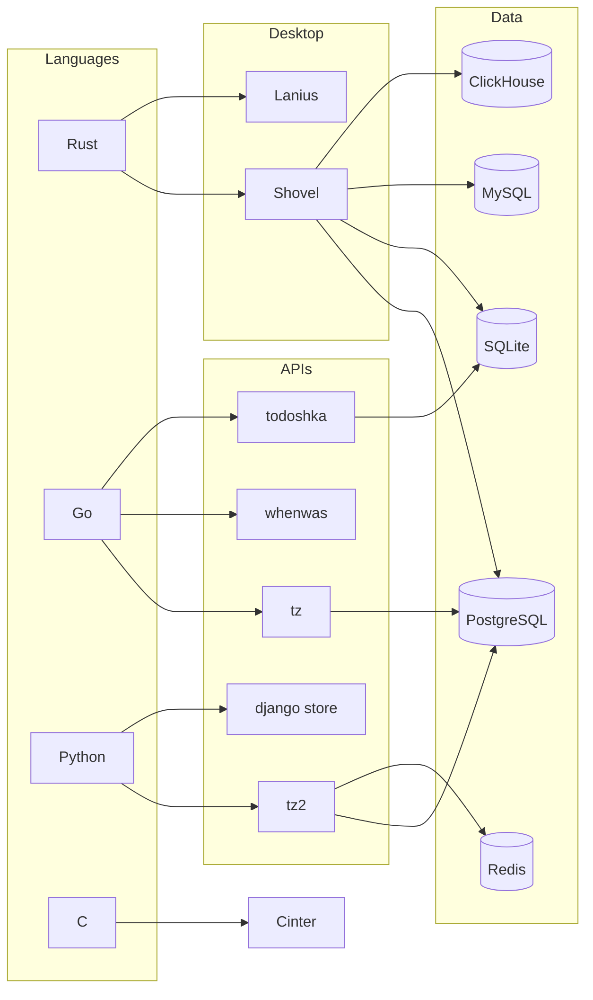
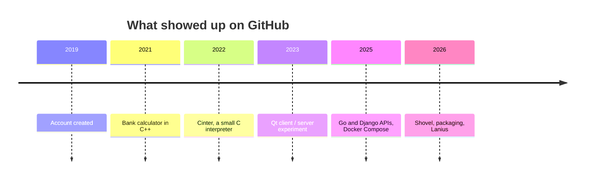
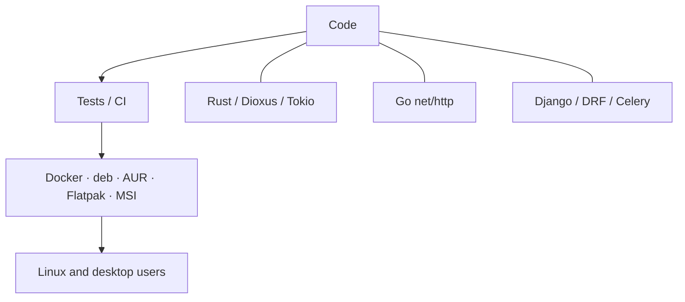

  

 

  

  <a href="#map">map</a> ·
  <a href="#projects">projects</a> ·
  <a href="#stack">stack</a> ·
  <a href="#github">github</a> ·
  <a href="mailto:rasulmagomedsaidov2002@gmail.com">email</a>

 

  

---

I build software that talks to databases, networks, and Linux. Public work is split across desktop tools, REST services, and small utilities, not one repo.

Open to backend, Rust, and Go roles.

## Map

How the public work sits together.

A more literal stack view

## Projects

Click a card. Stars and language update on their own.

  
  

  
  

  
  

<table>
<tr>
<td valign="top" width="50%">

**Shovel** — native database client in Rust. SQLite, PostgreSQL, MySQL, ClickHouse. Chat-first SQL, ACP agents, `.deb` / AUR / Flatpak / MSI.

[repo](https://github.com/Fynth/Shovel) · [install](https://fynth.github.io/Shovel/) · [releases](https://github.com/Fynth/Shovel/releases)

</td>
<td valign="top" width="50%">

**tz** — Go REST service for subscription records. PostgreSQL, migrations, Swagger, Docker Compose, `net/http`.

[repo](https://github.com/Fynth/tz)

</td>
</tr>
<tr>
<td valign="top">

**tz2** — Django REST task API plus a Telegram bot. Celery, Redis, PostgreSQL, Docker Compose.

[repo](https://github.com/Fynth/tz2)

</td>
<td valign="top">

**whenwas** — tiny Go service. Pass a domain, get the first Wayback Machine snapshot. Stdlib only.

[repo](https://github.com/Fynth/whenwas)

</td>
</tr>
<tr>
<td valign="top">

**awesome-django-store** — Django 5 shop: catalog, cart, orders, accounts.

[repo](https://github.com/Fynth/awesome-django-store)

</td>
<td valign="top">

**todoshka** — Go REST todo API. SQLite, Gorilla Mux, tests.

[repo](https://github.com/Fynth/todoshka)

</td>
</tr>
</table>

Older / smaller

- [Cinter](https://github.com/Fynth/Cinter) — C interpreter, written to learn how languages run
- [calculator](https://github.com/Fynth/calculator) — C++ calculator
- Lanius — agentless Linux configuration in Rust, not public yet

## Stack

| Layer | What I use |
| --- | --- |
| Languages | Rust, Go, Python, some C |
| Data | PostgreSQL, SQLite, MySQL, ClickHouse, Redis |
| Backend | REST, Django / DRF, Go `net/http`, Tokio, Celery |
| Desktop | Dioxus, SSH connections |
| Ship | Docker, Compose, GitHub Actions, Nginx, deb / AUR / Flatpak |

## GitHub

  
  

  

  

 

  <picture>
    <source media="(prefers-color-scheme: dark)" srcset="https://raw.githubusercontent.com/Fynth/Fynth/output/github-contribution-grid-snake-dark.svg" />
    <source media="(prefers-color-scheme: light)" srcset="https://raw.githubusercontent.com/Fynth/Fynth/output/github-contribution-grid-snake.svg" />
    
  </picture>

## Contact

[rasulmagomedsaidov2002@gmail.com](mailto:rasulmagomedsaidov2002@gmail.com)

[Shovel](https://github.com/Fynth/Shovel) · [tz](https://github.com/Fynth/tz) · [tz2](https://github.com/Fynth/tz2) · [whenwas](https://github.com/Fynth/whenwas)

